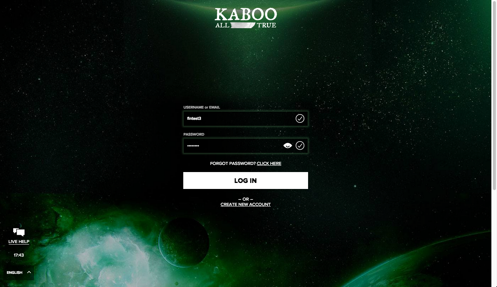
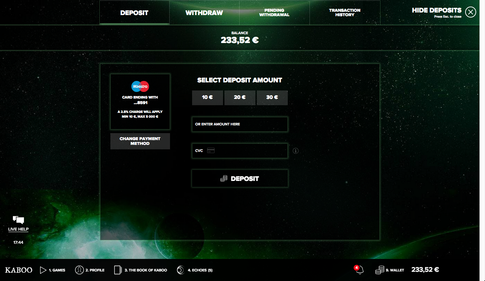
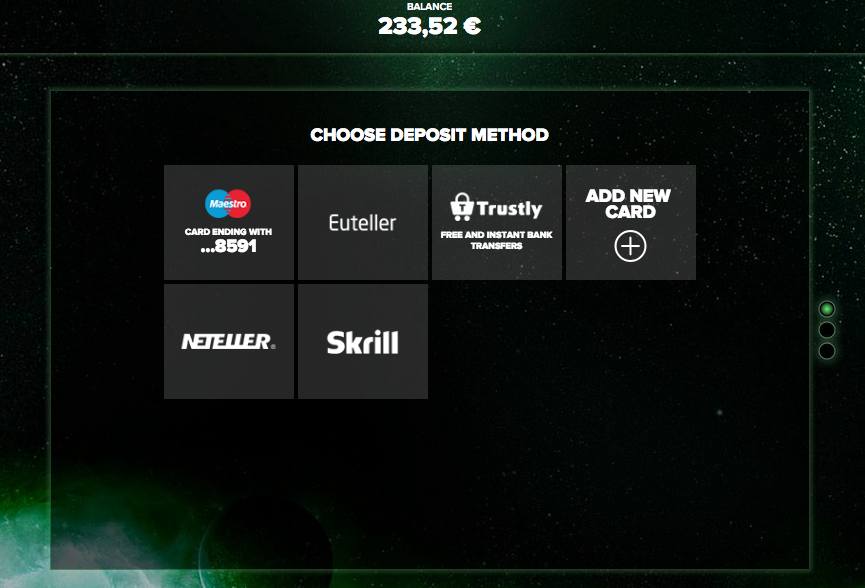
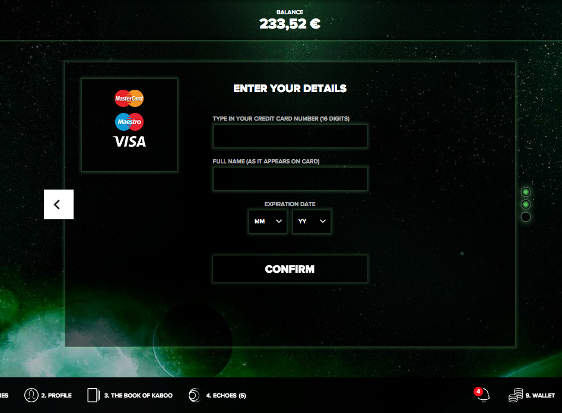

# Junior QA Test

## Intro
You will get access to two kaboo.com accounts.
You will login to those accounts using a special link. This version of kaboo.com will be almost identical to the production version, except that it's broken in very specific ways.

One of the accounts is a Swedish user using `SEK` as currency, and the other is a Finish user with `EUR` as currency.

## Preparation

1. You need access to 2 different browsers, at least Chrome and IE 10 or 11.

2. Go to: [http://qa.staging.kaboo.com](http://qa.staging.kaboo.com)

    

3. Enter the following details to  access to the site:

    ```
    username: kaboo
    password: flappybird
    ```

4. After clicking to LOG IN, enter either with the Swedish or the Finish user.

    

    Use the following details:

    *Swedish user:*
    ```
    username: sektest3
    password: Kabootest1
    ```

    *Finish user:*

    ```
    username: fintest3
    password: Kabootest1
    ```

5. Click on the Balance or Wallet icon (top right corner) to open the deposit screen.
    

6. Click on the Change deposit method button or the DEPOSIT tab (top left area)
    

## The objective

Your mission, should you choose to accept it:

1. Find the bugs in the Credit card deposit flow **(Both for NEW and already registered cards - each account has 1 card registered already).**
Applicant could use 5454 5454 5454 5454 for testing or a card number generator on the internet

    

    There could be browser specific errors, as well as general bugs for all browsers and accounts. PAY ATTENTION! 

2. Find out as much as possible about the bugs, and document them in a Word or similar file (steps, screenshots, browser...).
**Please DO NOT make deposits with the BONUS** but include it in your testing and when making the flow chart!!

3. Mind the provided credit card numbers are fake and transactions with them will work but with fake money. Transaction result therefore isn't something that should be considered.

4. Using your best judgement, create a flow chart ONLY _for NEW credit card_ deposits. **You can draw it on paper and take a picture with good resolution.**

5. Send the flow chart with the bugs report to `jaime.berrocal@mavrix.es`

**Good Luck! :-)**
