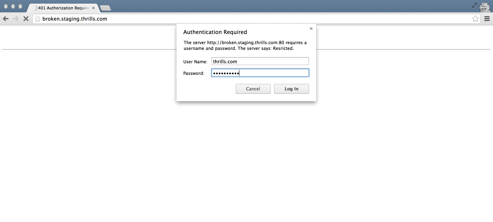
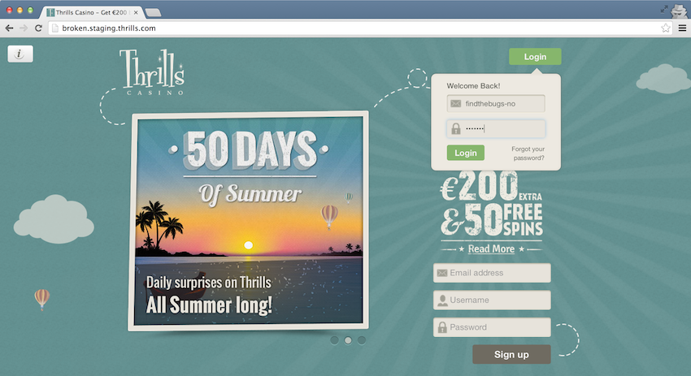
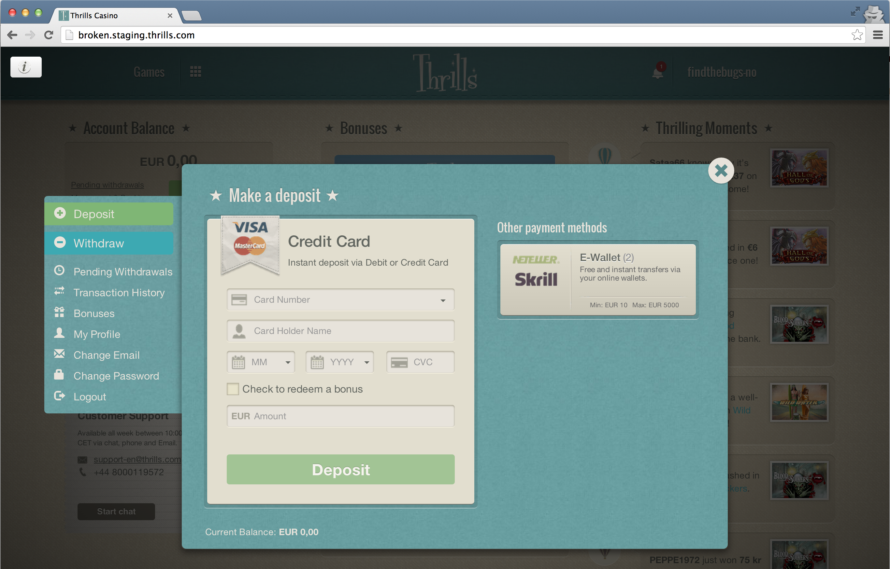
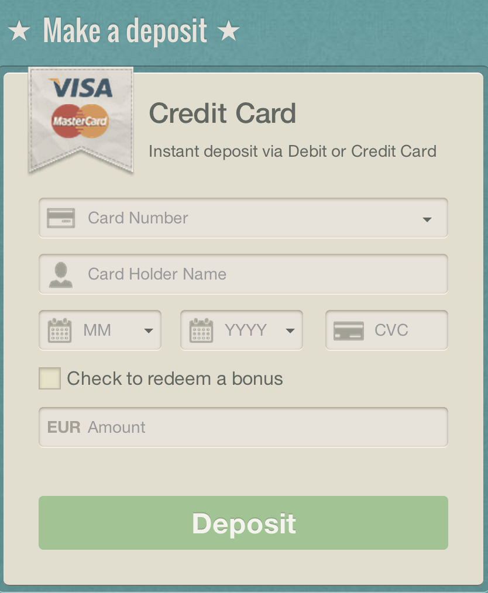

# QA Test

## Intro
You will get access to two thrills.com accounts.
You will login to those accounts using a special link. This version of thrills.com will be almost identical to the production version, except that its broken in very specific ways.

One of the accounts is a swedish user using `SEK` as currency, and the other is a norwegian user with `EUR` as currency.

## Preparation

1. You need access to different browsers, at least Chrome, Firefox and IE 10 and 11.

2. Go to: [http://broken.staging.thrills.com/](http://broken.staging.thrills.com/).

    

3. Enter the following details to  access to the site:

    ```
    username: thrills
    password: flappybird
    ```

4. Start with logging in with either the swedish or norwegian user.

    

    Use the following details:

    *Swedish user:*
    ```
    username: findthebugs-se
    password: l3tm31n
    ```

    *Norwegian user:*

    ```
    username: findthebugs-no
    password: l3tm31n
    ```

5. Click on the username in the top right corner to open the deposit modal.
    


## The objective

Your mission, should you choose to accept it:

1. Find the bugs in the Credit card deposit flow:

    

    Rest assured, there will be both browser specific errors, as well as account specific errors.

2. Find out as much as possible about the bugs, and document them.

3. Mind the provided credit card numbers are fake and transactions with their use won't result in successful deposit. Transaction result therefore isn't something that should be considered.

4. Using your best judgement, create regression-test criteria for the entire deposit flow _for credit cards_.

5. Send the regression-test criteria with the bug reports to `ifoundthebugs@thrills.com`

**Good Luck! :-)**
