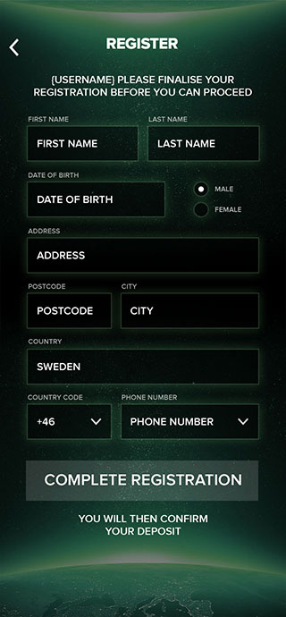

# UI Developer test

* [Intro](#intro)
* [Preparation and guides](#preparation-and-guides)
* [The objective](#the-objective)
    * [Desktop version](#desktop-version)
    * [Tablet version](#tablet-landscape-version)
    * [Mobile version](#mobile-version)
* [What we are looking for](#what-we-are-looking-for)
* [Assets](#assets)

## Intro
You will be presented with three photoshop files, one of a registration form for desktop, one for Tablet Lanscape and one for mobile. They are all retina ready.

## Preparation and guides
1. The test results should work for at least Chrome, Firefox and IE Edge and 11, as well as latest versions of iOS and Android.
    Some kind of access to those browsers will likely be needed.
2. For the JavaScript part of the test you can use vanilla JS or a framework of your choice.
3. You are not allowed to use any framework like for example `Bootstrap` or `Foundation`.
4. If you use a preprocessor, please include the source code when submitting the test.

## The objective
Your mission, should you choose to accept it:

1. Create a single html/css version of the three screens, fully responsive and hdpi ready (retina).
2. The desktop version should use custom dropdowns, as in the design.
3. The mobile and tablet version should trigger native form inputs.
4. Use JS to add fitting form validations. Validations can be found in the desktop version

  - First Name got success
  - Address got error
  - Last Name got focus
5. Even though it's a simple page, please structure files and code as if it was a big project
6. Add comments to your test, explaining your tools, ideas and conclusions.

### Desktop version

### Tablet Landscape version

### Mobile version

## What we are looking for
1. We want to see how you work with responsive & retina designs
2. We will analyse your file and code structure
3. We will see how you work with differences between mobile and desktop
4. We will see which tools you use, and how you use them.

## Assets
You can find the PSD files to follow in the  [assets](https://github.com/betit/recruitment-cases/tree/master/ui-developer/assets) folder.

**Good Luck! :-)**
